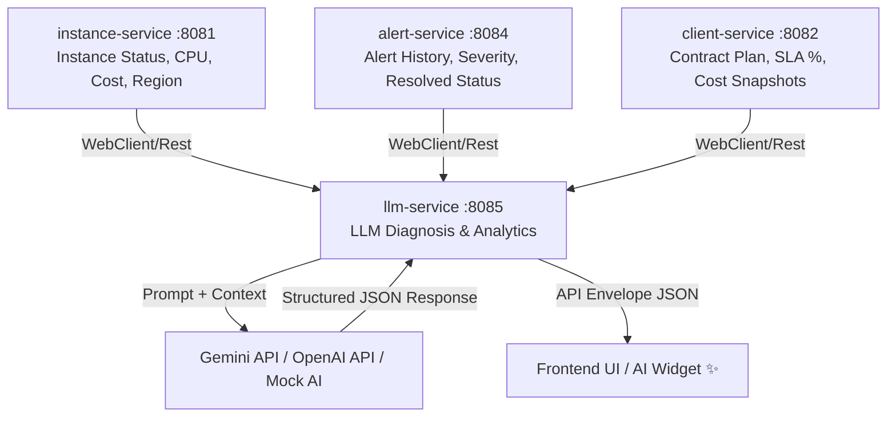

# KẾ HOẠCH PHÁT TRIỂN MODULE LLM (`llm-service`)
## Hệ thống Cloud Instance Monitoring System - TechValley

---

## 1. TỔNG QUAN VÀ MỤC TIÊU

### 1.1. Bối cảnh & Vai trò
Module `llm-service` (chạy độc lập tại Port `8085`) đóng vai trò là tầng trí tuệ nhân tạo (AI Layer) cho hệ thống **Cloud Instance Monitoring System**. Module này chịu trách nhiệm tích hợp Mô hình Ngôn ngữ Lớn (LLM - Large Language Model) để tự động hóa việc phân tích chỉ số vận hành, chẩn đoán nguyên nhân sự cố máy chủ ảo, dự báo rủi ro vi phạm cam kết chất lượng dịch vụ (SLA) và đề xuất các giải pháp tối ưu chi phí cho khách hàng.

### 1.2. Mục tiêu chính
1. **Chẩn đoán Tự động (Auto Diagnosis):** Biến dữ liệu thô (CPU usage, trạng thái `RUNNING`/`ERROR`, nhật ký Alert) thành thông tin phân tích kỹ thuật có cấu trúc.
2. **Hỗ trợ Ra Quyết định (Actionable Insights):** Đưa ra các bước hành động cụ thể cho kỹ sư vận hành (DevOps/SysAdmin) và quản lý khách hàng (`CLIENT_MANAGER`).
3. **Độc lập & Dự phòng (Fault Tolerance & Fallback):** Hoạt động theo kiến trúc Microservice, tích hợp cơ chế **Mock LLM Fallback** để đảm bảo hệ thống luôn phản hồi mượt mà kể cả khi không có kết nối internet hoặc API Key LLM bị hết quota.
4. **Tuân thủ Kiến trúc & UI/UX Guidelines:** Tuân thủ mô hình `Controller -> Service -> Repository -> Entity/Model`, chuẩn API Envelope (`success`, `code`, `message`, `data`, `timestamp`) và tích hợp UI/UX Widget AI với Skeleton Loader theo [UInUX_guideline.md](file:///d:/OTJprj_TechValley/UInUX_guideline.md).

---

## 2. PHÂN TÍCH NGUỒN DỮ LIỆU TỪ CÁC MODULE HIỆN CÓ

Dữ liệu đầu vào (Context) cho LLM sẽ được tổng hợp từ 4 module Microservices đã và đang phát triển:



### Các thông tin Context thu thập từ từng Service:
1. **Dữ liệu từ `instance-service` (Port 8081):**
   - `id`, `instanceName`, `instanceType` (VD: `c5.xlarge`, `t3.medium`).
   - `region` (VD: `ap-southeast-1`, `us-east-1`).
   - `status` (`RUNNING`, `STOPPED`, `ERROR`).
   - `cpuUsage` (Phần trăm tiêu thụ CPU hiện tại, e.g. `98.5%`).
   - `monthlyCost` (Chi phí duy trì hàng tháng).
   - `launcheAt` (Thời điểm khởi chạy).

2. **Dữ liệu từ `alert-service` (Port 8084):**
   - Danh sách các cảnh báo gần nhất liên kết với `instanceId`.
   - `alertType` (`HIGH_CPU`, `SYSTEM_ERROR`).
   - `message` (Nội dung chi tiết lỗi).
   - `detectedAt`, `isResolve` (Trạng thái đã xử lý hay chưa).

3. **Dữ liệu từ `client-service` (Port 8082):**
   - `clientName`, `contractPlan` (`BASIC`, `STANDARD`, `ENTERPRISE`).
   - Chỉ số SLA tính toán (% Uptime tháng).
   - Lịch sử `cost_snapshots` theo từng tháng.

---

## 3. CÁC OPTION PHÁT TRIỂN MODULE LLM

Dựa trên nhu cầu thực tế và tài liệu đặc tả [specification_OJTprj.md](file:///d:/OTJprj_TechValley/specification_OJTprj.md#L398-L423), có 3 phương án lựa chọn tính năng cho module LLM:

### Option 1: AI Auto-Diagnosis (Tự động Chẩn đoán Sự cố Máy chủ) — *Lựa chọn Khuyên dùng chính (Primary Spec)*

* **Endpoint chính:** `GET /api/instances/{id}/diagnosis`
* **Mô tả:** Nhận `instanceId`, `llm-service` tự động thu thập thông tin Instance và lịch sử Alert gần nhất, đóng gói thành Prompt gửi cho LLM để phân tích nguyên nhân gốc rễ và đưa ra giải pháp khắc phục.
* **Đầu ra mong muốn (Structured JSON):**
  * `healthScore` (Integer 0-100): Điểm sức khỏe máy chủ.
  * `diagnosis` (String): Tóm tắt tình trạng hiện tại.
  * `rootCause` (String): Phân tích nguyên nhân tiềm ẩn (VD: Memory Leak, DDoS, Deadlock DB).
  * `actionableSteps` (List<String>): Danh sách 3-5 bước khắc phục cụ thể theo thứ tự ưu tiên.
* **Đánh giá:** 
  * ⭐ **Độ khả thi:** Rất cao.
  * 🎯 **Giá trị nghiệp vụ:** Mang lại trải nghiệm Wow trực tiếp cho SysAdmin / DevOps. Đáp ứng 100% tài liệu yêu cầu đồ án.

---

### Option 2: AI Cost & SLA Optimizer (Tối ưu hóa Chi phí & Dự báo Vi phạm SLA)

* **Endpoint chính:** `GET /api/clients/{clientId}/cost-ai-recommendation`
* **Mô tả:** Đọc toàn bộ danh sách Instance thuộc về một Client, tổng chi phí hàng tháng (`monthly_cost`), chỉ số SLA Uptime hiện tại, và đề xuất phương án Right-sizing (nâng/hạ cấp server) hoặc tắt các máy chủ lãng phí.
* **Đầu ra mong muốn (Structured JSON):**
  * `currentEfficiencyScore` (Integer 0-100).
  * `potentialMonthlySavings` (Double - Số tiền $ có thể tiết kiệm).
  * `recommendations` (List<Object>): Đề xuất đổi instance type hoặc điều chỉnh cấu hình.
  * `slaRiskWarning` (String): Cảnh báo rủi ro vi phạm SLA trong tháng.
* **Đánh giá:** 
  * ⭐ **Độ khả thi:** Cao.
  * 🎯 **Giá trị nghiệp vụ:** Rất hữu ích cho vai trò `CLIENT_MANAGER` và Khách hàng Doanh nghiệp khi quản lý ngân sách Cloud.

---

### Option 3: Natural Language Ops Assistant (Trợ lý Hỏi-Đáp Hạ tầng Ngôn ngữ Tự nhiên)

* **Endpoint chính:** `POST /api/llm/chat`
* **Mô tả:** Cung cấp khung Chatbot tương tác trên giao diện Admin Dashboard. Cho phép `ADMIN` hoặc `CLIENT_MANAGER` đặt câu hỏi bằng tiếng Việt hoặc tiếng Anh (Ví dụ: *"Máy chủ nào của khách hàng TechValley đang bị nghẽn CPU?"*, *"Hãy tóm tắt danh sách các cảnh báo chưa được xử lý trong hôm nay"*).
* **Đầu ra mong muốn:** Chuỗi văn bản Markdown phản hồi trực tiếp kèm biểu đồ/thống kê tóm tắt.
* **Đánh giá:** 
  * ⭐ **Độ khả thi:** Trung bình (cần xử lý RAG hoặc Function Calling để truy vấn DB linh hoạt).
  * 🎯 **Giá trị nghiệp vụ:** Đột phá về mặt trải nghiệm UI/UX.

---

### 🏆 ĐỀ XUẤT HƯỚNG PHÁT TRIỂN TỔNG HỢP (COMBINED STRATEGY)
Khuyên dùng mô hình phát triển **Từng bước (Phased Rollout)**:
* **Giai đoạn 1 (MVP Cốt lõi):** Triển khai **Option 1 (`GET /api/instances/{id}/diagnosis`)**.
* **Giai đoạn 2 (Mở rộng Nghiệp vụ):** Triển khai **Option 2 (`GET /api/clients/{id}/cost-ai-recommendation`)**.
* **Giai đoạn 3 (Nâng cấp UI/UX):** Triển khai Widget Chatbot tương tác theo **Option 3**.

---

## 4. KIẾN TRÚC KỸ THUẬT & CHUYỂN ĐỔI MÔ HÌNH LLM (TECHNICAL ARCHITECTURE)

### 4.1. Tích hợp LLM Provider & Strategy Pattern
Để tránh phụ thuộc vào một nhà cung cấp AI duy nhất (Vendor Lock-in), `llm-service` sẽ áp dụng **Strategy Pattern**:

```text
llm-service/
├── service/
│   ├── LlmProviderService.java (Interface)
│   └── impl/
│       ├── GeminiLlmServiceImpl.java (Chính - Google Gemini 1.5 Flash API)
│       ├── OpenAiLlmServiceImpl.java (Dự phòng - OpenAI GPT-4o-mini)
│       └── MockLlmServiceImpl.java (Fallback - Chạy Offline / Test Rule-based)
```

#### Cấu hình linh hoạt qua `application.yml`:
```yaml
llm:
  provider: ${LLM_PROVIDER:gemini} # Các lựa chọn: gemini, openai, mock
  api-key: ${LLM_API_KEY:dummy_key}
  model: ${LLM_MODEL:gemini-1.5-flash}
  timeout-ms: 8000
  mock-enabled: true # Nếu API Key lỗi hoặc hết quota -> tự động fallback sang MockLlmServiceImpl
```

### 4.2. Thiết kế Prompt Engineering & JSON Schema Formatting

#### System Prompt Template (Chẩn đoán Instance):
```text
Bạn là một Chuyên gia Hạ tầng Đột xuất (Senior Cloud Reliability Engineer). 
Nhiệm vụ của bạn là phân tích dữ liệu telemetry của máy chủ ảo và lịch sử cảnh báo để tìm nguyên nhân gốc rễ và đưa ra giải pháp xử lý.

DỮ LIỆU ĐẦU VÀO (TELEMETRY CONTEXT):
- Tên Instance: {instanceName} (ID: {instanceId})
- Loaị cấu hình: {instanceType} | Vùng: {region}
- Trạng thái hiện tại: {status}
- Tỷ lệ sử dụng CPU: {cpuUsage}%
- Lịch sử Cảnh báo gần nhất: {alertHistoryJson}

YÊU CẦU ĐẦU RÀ:
Bắt buộc trả về đúng định dạng JSON tuân theo cấu trúc sau, không thêm lời mở đầu hay markdown ngoài khối JSON:
{
  "healthScore": <số nguyên từ 0 đến 100>,
  "diagnosis": "<tóm tắt tình trạng máy chủ>",
  "rootCause": "<nguyên nhân kỹ thuật chi tiết>",
  "actionableSteps": [
    "<bước 1>",
    "<bước 2>",
    "<bước 3>"
  ]
}
```

---

## 5. CẤU TRÚC MÃ NGUỒN VÀ DTO DESIGN

Tuân thủ nghiêm ngặt **Layered Architecture Guideline** (`AGENTS.md`):

### 5.1. Thư mục Package chuẩn:
```text
com.techvalley.llm/
├── controller/
│   └── LlmController.java
├── dto/
│   ├── request/
│   │   └── LlmQueryRequest.java
│   └── response/
│       ├── InstanceDiagnosisResponse.java
│       └── CostRecommendationResponse.java
├── exception/
│   ├── LlmException.java
│   └── LlmTimeoutException.java
├── client/
│   ├── InstanceServiceClient.java (WebClient gọi instance-service)
│   └── AlertServiceClient.java (WebClient gọi alert-service)
├── service/
│   ├── LlmService.java
│   ├── LlmProviderService.java
│   └── impl/
│       ├── LlmServiceImpl.java
│       ├── GeminiLlmServiceImpl.java
│       └── MockLlmServiceImpl.java
└── config/
    └── WebClientConfig.java
```

### 5.2. Chuẩn hóa API Response Envelope
Mọi API trả về cho Frontend đều được bọc bởi `ApiResponse<T>` từ `common-lib`:
```json
{
  "success": true,
  "code": 200,
  "message": "Phân tích chẩn đoán từ AI hoàn tất",
  "data": {
    "instanceId": 15,
    "instanceName": "payment-service-prod",
    "healthScore": 45,
    "diagnosis": "Máy chủ đang gặp tình trạng nghẽn CPU (98.5%) kéo dài.",
    "rootCause": "Nhiều khả năng xảy ra hiện tượng Memory Leak trong ứng dụng hoặc bị quá tải lưu lượng request.",
    "actionableSteps": [
      "1. Kiểm tra log ứng dụng để phát hiện thread bị treo.",
      "2. Tạm thời nâng cấp instance status/scale tài nguyên.",
      "3. Khởi động lại container nếu tình trạng ngưng trệ kéo dài."
    ]
  },
  "timestamp": "2026-08-05T09:30:00Z"
}
```

---

## 6. QUY TRÌNH PHÁT TRIỂN 8 BƯỚC (STEP-BY-STEP IMPLEMENTATION ROADMAP)

Để phát triển module `llm-service` thành công, tuân thủ đúng thứ tự 8 bước chuẩn dự án:

| Bước | Hạng mục | Chi tiết thực hiện |
| :--- | :--- | :--- |
| **Bước 1** | **Entity / DTO** | Tạo `InstanceDiagnosisResponse`, `CostRecommendationResponse` và các DTO nhận dữ liệu từ `instance-service` & `alert-service`. |
| **Bước 2** | **Inter-service Communication** | Cấu hình `WebClient` gọi REST API tới `instance-service` (Port 8081) và `alert-service` (Port 8084) để lấy dữ liệu telemetry. |
| **Bước 3** | **LLM Provider Integration** | Cài đặt `GeminiLlmServiceImpl` (gọi REST API của Gemini) và `MockLlmServiceImpl` (dự phòng rule-based khi offline/no-key). |
| **Bước 4** | **Business Logic Service** | Viết `LlmServiceImpl` ghép nối Context Data + Prompt Engineering -> Gọi Provider -> Parse JSON kết quả. |
| **Bước 5** | **REST Controller** | Khai báo `LlmController` với các Endpoint (`GET /api/instances/{id}/diagnosis`, `GET /api/clients/{id}/cost-ai-recommendation`). |
| **Bước 6** | **Exception Handling** | Xử lý các ngoại lệ `LlmException`, Timeout, lỗi kết nối API bên thứ 3 và tự động chuyển đổi sang Mock Response an toàn. |
| **Bước 7** | **Security & RBAC** | Cấu hình filter JWT, đảm bảo vai trò `ADMIN` hoặc `CLIENT_MANAGER` (chỉ truy cập Instance/Client thuộc quyền quản lý). |
| **Bước 8** | **Frontend UI Integration** | Tích hợp Widget AI ✨ trên UI với hiệu ứng **Skeleton Loader** trong khi chờ AI phản hồi theo chuẩn `UInUX_guideline.md`. |

---

## 7. ĐÁNH GIÁ RỦI RO & GIẢI PHÁP PHÒNG THỪA (RISK MANAGEMENT)

1. **Rủi ro API Timeout / Latency cao:**
   * *Giải pháp:* Thiết lập Timeout ngắn (e.g. 5-8 giây) cho WebClient. Nếu quá thời gian, chuyển ngay sang trả về kết quả Chẩn đoán Mô phỏng (Mock Rule-based) kèm nhãn thông báo *"Phân tích nhanh offline"*.
2. **Rủi ro AI trả về sai định dạng JSON (Malformed Output):**
   * *Giải pháp:* Sử dụng `ObjectMapper` của Jackson bọc trong khối `try-catch`. Nếu parse thất bại, sử dụng Regex extractor hoặc fallback về chuỗi diagnosis mặc định.
3. **Rủi ro Bảo mật Dữ liệu (Data Privacy):**
   * *Giải pháp:* Chỉ gửi các chỉ số hạ tầng tổng quát (`cpuUsage`, `instanceType`, `alertType`), tuyệt đối KHÔNG gửi mật khẩu, IP nội bộ nhạy cảm hoặc thông tin cá nhân của người dùng sang API LLM bên thứ ba.
